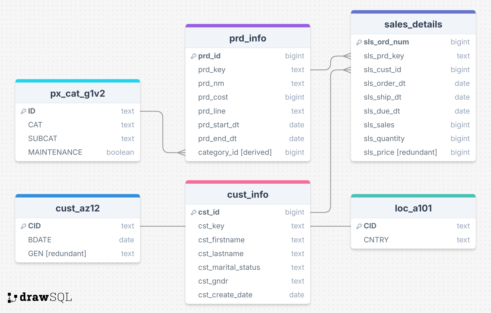

<h2 align="center">Data Dictionary</h2>

> [!NOTE]
> All information here was inferred from the raw data.

## Entity Relationship Diagram

## Entity Descriptions

### `px_cat_g1v2` -> `product_categories`

Represents product categories and subcategories.

| Field         | Type    | Description                                    |
| ------------- | ------- | ---------------------------------------------- |
| `ID`          | text    | Primary key for the category record            |
| `CAT`         | text    | Category name                                  |
| `SUBCAT`      | text    | Subcategory name                               |
| `MAINTENANCE` | boolean | Indicates if the category needs maintenance |

---

### `prd_info` -> `product_info`

Contains information about individual products.

| Field          | Type   | Description                             |
| -------------- | ------ | --------------------------------------- |
| `prd_id`       | bigint | Primary key for the product             |
| `prd_key`      | text   | External or alternate product key       |
| `prd_nm`       | text   | Product name                            |
| `prd_cost`     | bigint | Cost of the product                     |
| `prd_line`     | text   | N/A               |
| `prd_start_dt` | date   | N/A         |
| `prd_end_dt`   | date   | N/A         |
| `category_id`  | bigint | Derived from `prd_key`. Foreign key to `px_cat_g1v2.ID` |

---

### `sales_details`

Records individual sales transactions.

| Field          | Type   | Description                       |
| -------------- | ------ | --------------------------------- |
| `sls_ord_num`  | bigint | Primary key (order number)        |
| `sls_prd_key`  | text   | Foreign key to `prd_info.prd_key` |
| `sls_cust_id`  | bigint | Foreign key to `cust_info.cst_id` |
| `sls_order_dt` | date   | Order date                        |
| `sls_ship_dt`  | date   | Shipping date                     |
| `sls_due_dt`   | date   | Due date                          |
| `sls_sales`    | bigint | Total sales amount                |
| `sls_quantity` | bigint | Quantity sold                     |
| `sls_price`    | bigint | redundant column of sls_sales     |

---

### `cust_info` -> `customer_info`

Holds customer personal information.

| Field                | Type   | Description                       |
| -------------------- | ------ | --------------------------------- |
| `cst_id`             | bigint | Primary key for the customer      |
| `cst_key`            | text   | Alternate or external customer ID |
| `cst_firstname`      | text   | Customer first name               |
| `cst_lastname`       | text   | Customer last name                |
| `cst_marital_status` | text   | Marital status                    |
| `cst_gndr`           | text   | Gender                            |
| `cst_create_date`    | date   | Account creation date             |

---

### `cust_az12` -> `customer_birthdate`

Legacy or auxiliary customer dataset.

| Field   | Type | Description                                   |
| ------- | ---- | --------------------------------------------- |
| `CID`   | text | Foreign key to `cust_info.cst_key`|
| `BDATE` | date | Birth date                                    |
| `GEN`   | text | Gender (marked redundant because of `cust_info.cst_gndr`. Dropped before ingestion to the data warehouse.)  |

---

### `loc_a101` -> `customer_location`

Stores location information tied to customer IDs.

| Field   | Type | Description                    |
| ------- | ---- | ------------------------------ |
| `CID`   | text | Foreign key to `cust_info.cst_key` |
| `CNTRY` | text | Country                        |

---
